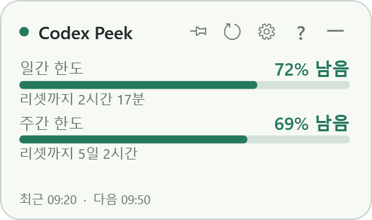
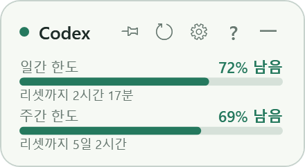
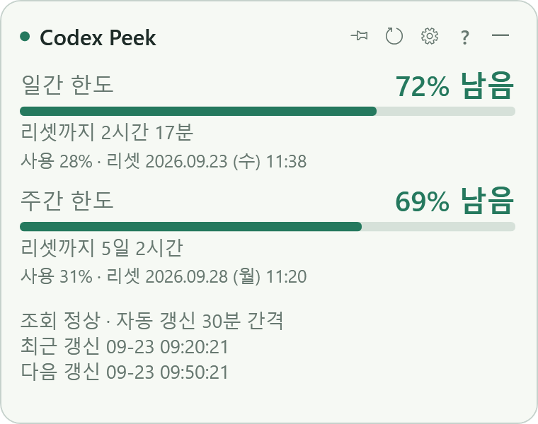

# Codex Peek

**Codex 구독의 잔여 사용 한도와 리셋 시간을 보여주는 Windows 데스크톱 위젯입니다.**

작업 중 작은 창으로 한도를 확인하고, 필요할 때 새로고침으로 최신 데이터를 조회합니다. 기본 자동 갱신 간격은 **30분**이며, 창 크기·배경 투명도·최상단 고정을 조절할 수 있습니다.



> 화면 예시에는 가상 수치를 사용했습니다. 일반 실행 시에는 현재 Codex에 로그인된 계정의 실제 조회 결과를 표시합니다. OpenAI의 공식 제품이 아닌 개인 프로젝트입니다.

## 주요 기능

| 기능 | 설명 |
| --- | --- |
| 구독 한도 조회 | 계정에서 반환하는 한도별 잔여 비율과 리셋 시간 표시 |
| 자동 업데이트 | 기본 30분, 1~1,440분 범위에서 1분 단위 설정 |
| 즉시 새로고침 | 새로고침 버튼 또는 F5로 조회하고 응답을 받는 즉시 화면 반영 |
| 창 크기 변경 | 창 가장자리와 모서리를 드래그해 크기 조절 |
| 작은 화면 대응 | 모든 크기에서 한도명·잔여 비율·막대·리셋 시간을 유지하며 글자와 여백을 조절 |
| 최상단 고정 | 핀 버튼으로 다른 일반 창 위에 고정하거나 해제 |
| 투명도 조절 | 배경 투명도를 바꾸면서 글자와 버튼의 가독성 유지 |
| 내장 도움말 | 상단 ? 버튼, F1, 트레이 메뉴로 사용법·계정·다른 PC·문제 해결 안내 열기 |
| 시스템 트레이 | 위젯 숨기기, 다시 표시, 새로고침, 설정, 종료 |
| 설정 복원 | 크기·위치·핀 상태·투명도·갱신 간격을 재실행 시 복원 |
| 시작 프로그램 | 설정에서 Windows 시작 시 실행을 선택 |
| 실패 상태 표시 | 조회 실패 시 이전 데이터와 마지막 성공 시각을 유지 |

**작은 창에서도 `주간 한도 · 69% 남음 · 리셋까지 5일 2시간`과 그래프를 함께 볼 수 있습니다.** 핵심 정보를 숨기지 않고 크기에 맞춰 글자와 여백만 조절합니다. 수치는 예시입니다.

| 화면 크기 | 표시 정보 |
| --- | --- |
| 작은 창: 높이 150 미만 | 한도명, 잔여 비율, 그래프, 리셋까지 남은 시간 |
| 기본 창: 기본 270×160 | 핵심 정보 + 최근·다음 갱신 시각 |
| 확대 창: 너비 340 이상, 높이 260 이상 | 기본 정보 + 사용한 비율, 정확한 리셋 날짜·요일·시각, 조회 상태, 자동 갱신 간격, 초 단위 최근·다음 갱신 시각 |

확대 화면에서는 창 크기에 맞춰 한도명·잔여 비율·리셋 시간·갱신 안내의 글자와 그래프가 함께 커집니다. 갱신 안내를 한도 정보 바로 아래에 배치해 가운데 빈 공간이 벌어지지 않도록 했습니다.

조회 중이나 갱신 실패 상태는 작은 창에서도 표시합니다. 정확한 리셋 시각은 PC 현지 시간을 사용합니다. 자세한 선정 이유와 표시 규칙은 [화면 정보 기획](docs/ui-layout-plan.md)에 정리했습니다.

최소 높이는 고정 130이 아니라 표시할 한도 내용에 맞춰 계산합니다. 한도가 하나면 더 낮게 줄일 수 있고, 조회 상태 안내가 나타나면 필요한 만큼만 높이를 확보했다가 복원합니다. 이전에 최소 크기로 저장된 창은 재실행 시 내용에 맞게 정리합니다.





한도 기간은 고정하지 않습니다. 예를 들어 계정에서 주간 한도만 제공하면 주간 한도만 표시하며, 여러 한도를 제공하면 각 항목을 표시합니다. 표시 공간이 부족하면 스크롤할 수 있습니다.

## 시작하기

### 필요한 환경

- Windows 데스크톱 환경 — 현재 개발·검증 환경은 Windows 11 x64입니다.
- **.NET 10 Desktop Runtime**: 빌드된 앱 실행에 필요합니다.
- **.NET 10 SDK**: 소스에서 빌드할 때 필요합니다.
- Codex 설치 및 ChatGPT 계정 로그인
- 한도 조회를 위한 인터넷 연결

현재 버전은 **단일 ChatGPT 로그인 계정의 구독 한도 조회**를 대상으로 합니다. API 키 기반 토큰·비용 추적은 포함하지 않습니다.

### 소스에서 빌드하고 실행

PowerShell에서 다음을 실행합니다.

```powershell
git clone https://github.com/ChoiHyunKong/codexPeek.git
cd codexPeek
.\build.ps1
.\app\CodexPeek.exe
```

`build.ps1`은 자동 검사를 실행한 다음 `app` 폴더에 실행 파일을 생성합니다. 빌드된 실행 파일과 로컬 실행 바로가기는 Git 저장소에 포함하지 않습니다.

이미 빌드된 로컬 프로젝트에서는 `app\CodexPeek.exe`를 실행하면 됩니다. 로컬에 생성된 `Codex Peek 실행.lnk` 바로가기도 사용할 수 있습니다. 다른 PC로 옮길 때는 `app` 폴더 전체를 복사하고 대상 PC에도 .NET 10 Desktop Runtime과 Codex를 준비해야 합니다.

## 사용 방법

- **이동:** 상단의 빈 공간을 드래그합니다.
- **크기 변경:** 창 테두리 또는 모서리를 드래그합니다.
- **최상단 고정 / 해제:** 상단 핀 버튼을 누릅니다. 고정 중에도 이동과 크기 조절이 가능합니다.
- **지금 새로고침:** 새로고침 버튼 또는 F5를 누릅니다.
- **도움말:** 상단 `?`, F1 또는 트레이 메뉴의 `도움말`을 누릅니다. 사용 방법 / 계정·다른 PC / 갱신·문제 해결의 세 탭을 인터넷 없이 읽을 수 있습니다. Esc 또는 닫기 버튼으로 닫습니다.
- **설정:** 톱니바퀴 버튼에서 갱신 간격, 배경 투명도, 시작 시 실행, Codex 실행 파일 경로를 변경합니다.
- **숨기기:** 상단의 `―` 버튼을 누르면 트레이에 유지됩니다.
- **다시 표시:** 트레이 아이콘을 더블클릭하거나 우클릭 메뉴에서 `위젯 표시`를 선택합니다.
- **종료:** 트레이 우클릭 메뉴의 `종료` 또는 Alt+F4를 사용합니다.

### 기본 설정

| 항목 | 기본값 | 조절 범위 / 동작 |
| --- | --- | --- |
| 자동 갱신 간격 | 30분 | 1~1,440분, 정수 입력 |
| 창 크기 | 270 × 160 | 최소 너비 220, 최소 높이는 표시 내용에 맞춰 조절, Windows 배율 적용 |
| 배경 투명도 | 15% | 0~80%, 0%는 불투명 |
| 최상단 고정 | 꺼짐 | 핀 버튼으로 전환 |
| Windows 시작 시 실행 | 꺼짐 | 설정에서 선택 |
| Codex 실행 파일 | 자동 검색 | 필요한 경우 codex.exe 경로 직접 선택 |

설정 파일 위치는 `%LOCALAPPDATA%\CodexPeek\settings.json`입니다. 계정 로그인 토큰은 위젯이 직접 읽거나 별도로 저장하지 않습니다.

## 갱신 방식

1. 위젯 실행 시 즉시 한도를 조회합니다.
2. 조회에 성공하면 그 시각부터 설정된 간격을 계산합니다.
3. 수동 새로고침에 성공해도 다음 자동 갱신 시각을 다시 계산합니다.
4. 요청 진행 중에는 중복 조회를 막습니다. 응답 제한 시간은 30초입니다.
5. 조회 실패 시 마지막 성공 데이터를 유지하고 실패 상태를 표시합니다. 설정된 간격 후 자동 재시도하며, 수동 새로고침은 즉시 사용할 수 있습니다.
6. 절전에서 복귀했을 때 예정된 갱신 시각이 지났다면 바로 조회합니다.

리셋까지 남은 시간은 화면에서 매초 다시 계산하지만, 서버 사용량 조회는 자동 갱신 시각이나 수동 새로고침 때 수행합니다. 서버 집계 지연 때문에 방금 수행한 작업이 즉시 수치에 반영되지 않을 수 있습니다. 리셋 시각이 지나더라도 새 서버 응답 없이 잔여량을 임의로 복구하지 않습니다.

## 구현 구조

C# / .NET 10 / WPF로 구현하고 시스템 트레이에는 Windows Forms `NotifyIcon`을 사용합니다. 외부 NuGet 패키지는 사용하지 않습니다.

Codex App Server에 `initialize` → `account/read` → `account/rateLimits/read` 순서로 요청합니다. 위젯은 모델 실행이나 프롬프트 요청을 보내지 않습니다. 공식 프로토콜은 [Codex App Server 문서](https://learn.chatgpt.com/docs/app-server)를 참고하세요.

```text
codexPeek/
├─ src/
│  ├─ App.cs                  # 위젯, 설정 창, 트레이, Windows 연동
│  ├─ HelpWindow.cs           # 사용법·계정·갱신 안내 창
│  ├─ Core.cs                 # JSON-RPC, 한도 파싱, 갱신 일정, 설정 저장
│  ├─ CodexPeek.csproj
│  └─ app.manifest
├─ tests/                     # 한도 파싱·갱신 일정·프로토콜 자동 검사
├─ tools/                     # 개발용 Codex 연결 확인 도구
├─ artifacts/                 # 가상 데이터로 만든 화면 예시
├─ build.ps1                  # 자동 검사 후 실행 파일 생성
└─ README.md
```

`app`, `bin`, `obj`, 로컬 조회 결과, 로그, 사용자 설정, 실행 바로가기는 버전 관리에서 제외합니다.

## 검증 현황

2026-09-22 초기 구현 시 다음을 확인했습니다.

- Release 빌드: 경고 0개, 오류 0개
- 자동 검사 **17개 통과**: 단일/복수 한도 파싱, 누락 값, 잔여 비율 범위, 리셋 시각 경과, 30분 일정, 수동 조회 후 일정 재설정, 실패 시 마지막 성공 유지, 설정 직렬화, JSON-RPC 초기화, 오류 응답, 취소 처리 등
- 실제 로그인 계정으로 한도 조회 성공
- 기본·최소·확장 크기의 WPF 화면 렌더링 확인
- 검증 모드에서 핀 고정 전환 및 배경 투명도 속성 확인

실제 데스크톱에서의 최종 클릭·드래그 조작 검증은 당시 중단되어 완료하지 못했습니다. 렌더링 검사와 자동 검사 결과가 모든 Windows 환경의 동작을 보장하지는 않습니다.

2026-09-23 후속 UI 수정에서는 최소·기본·확대·전환 경계·좁고 긴 창·넓고 낮은 창·크기 복원과 큰 창(640×480, 900×620), 주간 한도만 있는 확대 창 및 주간 한도의 최소 크기 등 16개 화면을 렌더링했습니다. 핵심 글자와 그래프가 항상 유지되는지, 확대 상세 정보와 실패 시 이전 데이터 표시가 정확한지, 주간 한도만 제공하는 계정에 임의의 일간 한도를 추가하지 않는지 검증했습니다.

내장 도움말은 물음표 버튼으로 열기, 중복 창 방지, 세 탭의 상단·하단 렌더링, 닫기 후 상태 정리를 확인했습니다.

자동 검사만 실행하려면:

```powershell
dotnet run --project .\tests\CodexPeek.Tests.csproj -c Release
```

## 개발 히스토리

| 날짜 | 진행 내용 |
| --- | --- |
| 2026-09-22 | 기획 시작. Windows 전용 소형 위젯, 단일 계정의 Codex 구독 한도 조회로 초기 범위 확정 |
| 2026-09-22 | 자동 갱신 기본 30분, 분 단위 설정, 수동 즉시 조회, 배경 투명도 조절 설계 |
| 2026-09-22 | 크기 조절과 스티커 메모 방식의 최상단 고정·해제, 창 상태 복원 추가 |
| 2026-09-22 | 프로젝트 이름을 Codex Peek로 정하고 WPF 앱 구현. 실제 계정 조회 및 자동 검사 17개 통과 |
| 2026-09-22 | 최소 크기에서 정보가 잘리지 않도록 작은 화면 배치 개선. 실행 파일과 로컬 바로가기 생성 |
| 2026-09-23 | GitHub 최초 등록을 위한 소스 정리. README에 기능, 실행 방법, 검증 범위, 개발 히스토리 작성 |
| 2026-09-23 | 작은 창에서 그래프 바가 사라지던 동작 수정. 기본 크기에서는 한도명과 상세 정보, 축소 시에는 그래프 바를 표시하고 툴팁으로 세부 정보 제공 |
| 2026-09-23 | 요구사항 재확인 후 모든 크기에서 한도명·잔여 비율·리셋 시간·그래프 유지. 확대 화면의 사용한 비율·정확한 리셋 시각·조회 상태·갱신 일정 기획 및 구현 |
| 2026-09-23 | 확대 시 글자·그래프의 비례 확대 적용. 갱신 안내를 한도 정보 아래에 배치해 중앙 여백 축소. 큰 창과 단일 한도 배치 검증 추가 |
| 2026-09-23 | 최소 높이를 내용 기반으로 변경해 하단 빈 공간 제거. 주간 단일 한도와 한도 2개, 조회 중 높이 복원 검증 |
| 2026-09-23 | ? 버튼·F1·트레이 메뉴로 여는 내장 도움말 추가. 사용 방법, 계정·다른 PC, 갱신·문제 해결의 세 탭과 전체 설명서 링크 제공 |

## 향후 확장 후보

아래 항목은 현재 구현 범위에 포함되지 않은 아이디어입니다.

- 사용 이력 그래프
- 여러 계정 전환
- 잔여 한도 임계치 알림
- API 사용량 및 비용 추적
- 설치 패키지와 GitHub Releases 배포
