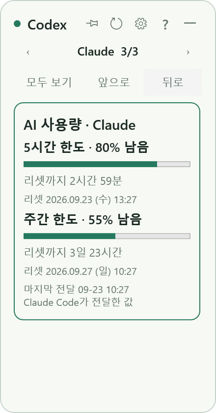
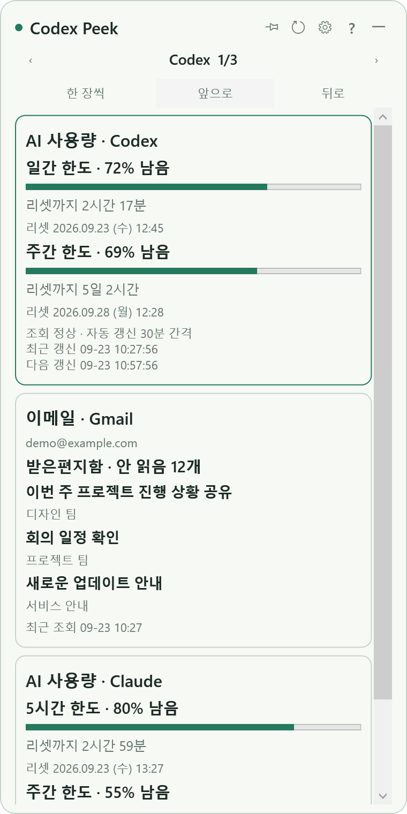

# Codex Peek

**Codex 구독의 잔여 사용 한도와 리셋 시간을 보여주는 Windows 데스크톱 위젯입니다.**

작업 중 작은 창으로 한도를 확인하고, 필요할 때 새로고침으로 최신 데이터를 조회합니다. 기본 자동 갱신 간격은 **30분**이며, 창 크기·배경 투명도·최상단 고정을 조절할 수 있습니다.


> 화면 예시에는 가상 수치를 사용했습니다. 일반 실행 시에는 현재 Codex에 로그인된 계정의 실제 조회 결과를 표시합니다. OpenAI의 공식 제품이 아닌 개인 프로젝트입니다.

## 주요 기능

| 기능 | 설명 |
| --- | --- |
| 구독 한도 조회 | 계정에서 반환하는 한도별 잔여 비율과 리셋 시간 표시 |
| 자동 업데이트 | 기본 30분, 1~1,440분 범위에서 1분 단위 설정 |
| 즉시 새로고침 | 새로고침 버튼 또는 F5로 조회하고 응답을 받는 즉시 화면 반영 |
| 창 크기 변경 | 창 가장자리와 모서리를 드래그해 크기 조절 |
| 작은 화면 대응 | 모든 크기에서 한도명·잔여 비율·막대·리셋 시간을 유지하며 글자와 여백을 조절 |
| 최상단 고정 | 핀 버튼으로 다른 일반 창 위에 고정하거나 해제 |
| 투명도 조절 | 배경 투명도를 바꾸면서 글자와 버튼의 가독성 유지 |
| 내장 도움말 | 상단 ? 버튼, F1, 트레이 메뉴로 사용법·계정·다른 PC·문제 해결 안내 열기 |
| 세로형 대시보드 | 최소 너비 220에서도 높이에 따라 상세 정보와 이메일·Claude 카드를 표시 |
| Gmail | 연결 후 받은편지함의 안 읽은 메일 수와 최근 3개 제목·보낸 사람 표시 |
| Claude Code | 상태 표시줄에서 전달받은 5시간·주간 한도와 마지막 전달 시각 표시 |
| 카드 전환·순서 변경 | ‹ ›로 서비스 전환, 앞으로·뒤로로 순서 변경, 한 장씩·모두 보기와 선택 상태 저장 |
| 작업표시줄 보호 | 이동·크기 변경·복원 시 현재 모니터의 작업 영역에 맞춰 위치와 크기 보정 |
| 시스템 트레이 | 위젯 숨기기, 다시 표시, 새로고침, 설정, 종료 |
| 설정 복원 | 크기·위치·핀 상태·투명도·갱신 간격을 재실행 시 복원 |
| 시작 프로그램 | 설정에서 Windows 시작 시 실행을 선택 |
| 실패 상태 표시 | 조회 실패 시 이전 데이터와 마지막 성공 시각을 유지 |

**작은 창에서도 `주간 한도 · 69% 남음 · 리셋까지 5일 2시간`과 그래프를 함께 볼 수 있습니다.** 핵심 정보를 숨기지 않고 크기에 맞춰 글자와 여백만 조절합니다. 수치는 예시입니다.

| 화면 크기 | 표시 정보 |
| --- | --- |
| 작은 창: 높이 150 미만 | 한도명, 잔여 비율, 그래프, 리셋까지 남은 시간 |
| 기본 창: 기본 270×160 | 핵심 정보 + 최근·다음 갱신 시각 |
| 확대 창: 높이 260 이상, 너비 무관 | 기본 정보 + 사용한 비율, 정확한 리셋 날짜·요일·시각, 조회 상태, 자동 갱신 간격, 초 단위 최근·다음 갱신 시각 |
| 카드 대시보드: 높이 360 이상 | Codex·Gmail·Claude를 좌우 버튼으로 전환하거나 세로로 모두 보기, 카드 순서 변경 |

확대 화면에서는 창 크기에 맞춰 한도명·잔여 비율·리셋 시간·갱신 안내의 글자와 그래프가 함께 커집니다. 갱신 안내를 한도 정보 바로 아래에 배치해 가운데 빈 공간이 벌어지지 않도록 했습니다.

조회 중이나 갱신 실패 상태는 작은 창에서도 표시합니다. 정확한 리셋 시각은 PC 현지 시간을 사용합니다. 자세한 선정 이유와 표시 규칙은 [화면 정보 기획](docs/ui-layout-plan.md)에 정리했습니다.

최소 높이는 고정 130이 아니라 표시할 한도 내용에 맞춰 계산합니다. 한도가 하나면 더 낮게 줄일 수 있고, 조회 상태 안내가 나타나면 필요한 만큼만 높이를 확보했다가 복원합니다. 이전에 최소 크기로 저장된 창은 재실행 시 내용에 맞게 정리합니다.


한도 기간은 고정하지 않습니다. 예를 들어 계정에서 주간 한도만 제공하면 주간 한도만 표시하며, 여러 한도를 제공하면 각 항목을 표시합니다. 표시 공간이 부족하면 스크롤할 수 있습니다.

## 시작하기

### 필요한 환경

- Windows 데스크톱 환경 — 현재 개발·검증 환경은 Windows 11 x64입니다.
- **.NET 10 Desktop Runtime**: 빌드된 앱 실행에 필요합니다.
- **.NET 10 SDK**: 소스에서 빌드할 때 필요합니다.
- Codex 설치 및 ChatGPT 계정 로그인
- 한도 조회를 위한 인터넷 연결

Codex는 **단일 ChatGPT 로그인 계정의 구독 한도 조회**를 대상으로 합니다. Gmail과 Claude Code는 선택적으로 연결합니다. API 키 기반 토큰·비용 추적은 포함하지 않습니다.

## 이메일 · Claude 연결

창 높이를 360 이상으로 늘리면 **Codex·Gmail·Claude를 ‹ › 버튼으로 넘겨 보는 카드 화면**이 나타납니다. **모두 보기**는 세로 배치, **한 장씩**은 좌우 전환 방식입니다. 선택한 카드는 **앞으로·뒤로**로 순서를 바꾸며, 세로 배치에서는 제목을 눌러 선택할 수도 있습니다. 순서·선택·보기 방식은 저장됩니다.

최소 너비에서도 동작하며 기존 작은 창은 Codex 핵심 정보를 유지합니다. **메인 화면에는 연결 관리 버튼을 두지 않습니다.** 톱니바퀴 환경설정의 **이메일 · AI 연결 관리**에서 연결합니다. 트레이 메뉴로도 열 수 있습니다. Spotify·Gemini·Outlook은 아직 구현하지 않았습니다.



위젯은 현재 모니터의 Windows 작업 영역 안에 머물도록 이동·크기·복원을 보정합니다. 하단 작업표시줄뿐 아니라 상단·좌측 작업표시줄과 음수 좌표의 보조 모니터도 처리하며 핀 설정은 그대로 유지합니다. 별도 독바 프로그램은 Windows 작업 영역을 예약하는 경우에 이 규칙이 적용됩니다.



### Gmail

1. [Google Cloud 안내](https://developers.google.com/workspace/gmail/api/quickstart/dotnet)에 따라 프로젝트에서 Gmail API를 켭니다.
2. OAuth 동의 화면을 설정하고, 테스트 모드라면 사용할 Google 계정을 테스트 사용자에 추가합니다.
3. OAuth 클라이언트 유형을 **데스크톱 앱**으로 만들고 JSON을 다운로드합니다.
4. 위젯의 **이메일 · AI 연결 → JSON 선택 후 Google 로그인**에서 파일을 선택한 뒤 브라우저에서 로그인합니다.

`gmail.metadata` 권한으로 받은편지함의 정확한 안 읽은 메시지 수와 최근 3개 메시지의 제목·보낸 사람을 읽습니다. 메일 본문·첨부파일 조회 및 전송·삭제·읽음 처리 기능은 없습니다. 검색 결과 추정치를 안 읽은 수로 사용하지 않습니다. OAuth는 시스템 브라우저, 로컬 루프백 콜백, PKCE, state 검증을 사용합니다.

기본 30분 및 F5로 조회하고, Codex 조회와 독립적으로 실행합니다. 실패 시 이전 목록에 실패 안내와 마지막 성공 시각을 표시합니다. 제목과 보낸 사람은 메모리에만 보관하며 종료 시 사라집니다. 연결 정보는 `%LOCALAPPDATA%\CodexPeek\gmail-credentials.bin`에 **현재 Windows 사용자에 종속된 DPAPI 암호화**로 저장합니다. 앱 폴더를 복사해도 다른 PC에서는 다시 연결해야 합니다.

연결 해제는 이 PC의 토큰과 표시 목록을 지웁니다. Google 서버에 부여한 권한까지 철회하려면 Google 계정의 서드 파티 연결에서 해제하세요. 테스트 모드 인증은 만료되어 재연결이 필요할 수 있습니다. 공개 배포 시 Gmail의 제한된 권한에 대한 Google 검증이 별도로 필요합니다. OAuth 클라이언트 JSON·토큰은 Git에 올리지 마세요.

### Claude Code

**이메일 · AI 연결 → Claude Code 연결**을 누르면 Claude 사용자 설정의 `statusLine`을 연결합니다. 기존 설정 파일은 날짜가 붙은 `.bak`으로 백업하며, 이미 다른 상태 표시줄을 사용 중이면 자동으로 덮어쓰지 않습니다. `CLAUDE_CONFIG_DIR`가 있으면 해당 설정 디렉터리를 사용합니다. 연결 해제는 현재 이 앱의 명령인 경우에만 `statusLine`을 제거합니다.

Claude Code가 `rate_limits.five_hour`·`rate_limits.seven_day`를 전달하면 위젯에 표시합니다. **사용량 필드를 지원하는 Claude Code와 지원 계정이 필요**하며 첫 응답 전에는 한도가 없을 수 있습니다. 한도 필드가 없으면 임의로 0%나 100%를 표시하지 않습니다. 받은 원본 전체를 저장하지 않고 한도와 전달 시각만 `%LOCALAPPDATA%\CodexPeek\claude-usage.json`에 저장합니다.

Claude의 새로고침은 마지막 로컬 전달 값을 다시 읽는 동작입니다. Codex·Gmail처럼 서버에서 새 수치를 직접 가져오지 않습니다. **마지막 전달 시각은 서버 집계 시각이 아닙니다.** 계정을 바꾸면 연결 해제·재연결로 이전 캐시를 지우고 Claude Code의 새 응답을 기다리세요. 상태 표시줄이 여러 세션에서 실행되면 마지막으로 전달한 세션의 값이 표시됩니다.

새 파일은 약 **2초 이내에 자동 반영**하므로 30분 주기를 기다릴 필요가 없습니다. 연결 전, 연결됨·데이터 대기, 데이터는 받았으나 한도 없음, 수신 실패를 구분합니다. 한국어 Windows에서 UTF-8/BOM 입력이 잘못 해석되던 문제를 수정했으며 PowerShell 전달 단계도 UTF-8 원문을 읽습니다. 이전 Codex Peek 연결 명령은 앱 실행 시 백업 후 새 명령으로 갱신합니다. 다른 상태 표시줄 명령은 변경하지 않습니다.

기존 상태 표시줄을 유지하려면 현재 스크립트가 받은 JSON을 아래 실행 파일에도 표준 입력으로 전달하도록 직접 합칠 수 있습니다. 이 앱은 `--claude-statusline` 실행 시 한도 필드만 저장하고 한 줄의 상태 문구를 출력합니다. 아래는 Git Bash 환경의 수동 연결 예시입니다. 자동 연결은 Git Bash와 PowerShell 양쪽에서 공백·따옴표가 포함된 경로를 안전하게 처리하도록 PowerShell 인코딩 명령을 생성합니다.

```json
{"statusLine":{"type":"command","command":"\"C:/your/path/CodexPeek.exe\" --claude-statusline"}}
```

앱 폴더를 옮긴 경우 연결 해제·재연결로 실행 경로를 갱신하세요. 프로젝트별 Claude 설정이나 조직 정책이 사용자 상태 표시줄을 덮어쓰면 데이터가 전달되지 않을 수 있습니다.

연동 근거: [Claude 상태 표시줄](https://code.claude.com/docs/en/statusline), [Google 데스크톱 OAuth](https://developers.google.com/identity/protocols/oauth2/native-app), [Gmail 권한](https://developers.google.com/workspace/gmail/api/auth/scopes).

### 소스에서 빌드하고 실행

PowerShell에서 다음을 실행합니다.

```powershell
git clone https://github.com/ChoiHyunKong/codexPeek.git
cd codexPeek
.\build.ps1
.\app\CodexPeek.exe
```

`build.ps1`은 자동 검사를 실행한 다음 `app` 폴더에 실행 파일을 생성합니다. 빌드된 실행 파일과 로컬 실행 바로가기는 Git 저장소에 포함하지 않습니다.

이미 빌드된 로컬 프로젝트에서는 `app\CodexPeek.exe`를 실행하면 됩니다. 로컬에 생성된 `Codex Peek 실행.lnk` 바로가기도 사용할 수 있습니다. 다른 PC로 옮길 때는 `app` 폴더 전체를 복사하고 대상 PC에도 .NET 10 Desktop Runtime과 Codex를 준비해야 합니다.

## 사용 방법

- **이동:** 상단의 빈 공간을 드래그합니다.
- **크기 변경:** 창 테두리 또는 모서리를 드래그합니다.
- **최상단 고정 / 해제:** 상단 핀 버튼을 누릅니다. 고정 중에도 이동과 크기 조절이 가능합니다.
- **지금 새로고침:** 새로고침 버튼 또는 F5를 누릅니다.
- **도움말:** 상단 `?`, F1 또는 트레이 메뉴의 `도움말`을 누릅니다. 사용 방법 / 계정·다른 PC / 갱신·문제 해결의 세 탭을 인터넷 없이 읽을 수 있습니다. Esc 또는 닫기 버튼으로 닫습니다.
- **설정:** 톱니바퀴 버튼에서 갱신 간격, 배경 투명도, 시작 시 실행, Codex 실행 파일 경로를 변경합니다.
- **숨기기:** 상단의 `―` 버튼을 누르면 트레이에 유지됩니다.
- **다시 표시:** 트레이 아이콘을 더블클릭하거나 우클릭 메뉴에서 `위젯 표시`를 선택합니다.
- **종료:** 트레이 우클릭 메뉴의 `종료` 또는 Alt+F4를 사용합니다.

### 기본 설정

| 항목 | 기본값 | 조절 범위 / 동작 |
| --- | --- | --- |
| 자동 갱신 간격 | 30분 | 1~1,440분, 정수 입력 |
| 창 크기 | 270 × 160 | 최소 너비 220, 최소 높이는 표시 내용에 맞춰 조절, Windows 배율 적용 |
| 배경 투명도 | 15% | 0~80%, 0%는 불투명 |
| 최상단 고정 | 꺼짐 | 핀 버튼으로 전환 |
| Windows 시작 시 실행 | 꺼짐 | 설정에서 선택 |
| Codex 실행 파일 | 자동 검색 | 필요한 경우 codex.exe 경로 직접 선택 |

설정 파일 위치는 `%LOCALAPPDATA%\CodexPeek\settings.json`입니다. 계정 로그인 토큰은 위젯이 직접 읽거나 별도로 저장하지 않습니다.

## 갱신 방식

1. 위젯 실행 시 즉시 한도를 조회합니다.
2. 조회에 성공하면 그 시각부터 설정된 간격을 계산합니다.
3. 수동 새로고침에 성공해도 다음 자동 갱신 시각을 다시 계산합니다.
4. 요청 진행 중에는 중복 조회를 막습니다. 응답 제한 시간은 30초입니다.
5. 조회 실패 시 마지막 성공 데이터를 유지하고 실패 상태를 표시합니다. 설정된 간격 후 자동 재시도하며, 수동 새로고침은 즉시 사용할 수 있습니다.
6. 절전에서 복귀했을 때 예정된 갱신 시각이 지났다면 바로 조회합니다.

리셋까지 남은 시간은 화면에서 매초 다시 계산하지만, 서버 사용량 조회는 자동 갱신 시각이나 수동 새로고침 때 수행합니다. 서버 집계 지연 때문에 방금 수행한 작업이 즉시 수치에 반영되지 않을 수 있습니다. 리셋 시각이 지나더라도 새 서버 응답 없이 잔여량을 임의로 복구하지 않습니다.

## 구현 구조

C# / .NET 10 / WPF로 구현하고 시스템 트레이에는 Windows Forms `NotifyIcon`을 사용합니다. 외부 NuGet 패키지는 사용하지 않습니다.

Codex App Server에 `initialize` → `account/read` → `account/rateLimits/read` 순서로 요청합니다. 위젯은 모델 실행이나 프롬프트 요청을 보내지 않습니다. 공식 프로토콜은 [Codex App Server 문서](https://learn.chatgpt.com/docs/app-server)를 참고하세요.

```text
codexPeek/
├─ src/
│  ├─ App.cs                  # 위젯, 설정 창, 트레이, Windows 연동
│  ├─ HelpWindow.cs           # 사용법·계정·갱신 안내 창
│  ├─ Core.cs                 # JSON-RPC, 한도 파싱, 갱신 일정, 설정 저장
│  ├─ CodexPeek.csproj
│  └─ app.manifest
├─ tests/                     # 한도 파싱·갱신 일정·프로토콜 자동 검사
├─ tools/                     # 개발용 Codex 연결 확인 도구
├─ artifacts/                 # 가상 데이터로 만든 화면 예시
├─ build.ps1                  # 자동 검사 후 실행 파일 생성
└─ README.md
```

`app`, `bin`, `obj`, 로컬 조회 결과, 로그, 사용자 설정, 실행 바로가기는 버전 관리에서 제외합니다.

## 검증 현황

2026-09-22 초기 구현 시 다음을 확인했습니다.

- Release 빌드: 경고 0개, 오류 0개
- 자동 검사 **17개 통과**: 단일/복수 한도 파싱, 누락 값, 잔여 비율 범위, 리셋 시각 경과, 30분 일정, 수동 조회 후 일정 재설정, 실패 시 마지막 성공 유지, 설정 직렬화, JSON-RPC 초기화, 오류 응답, 취소 처리 등
- 실제 로그인 계정으로 한도 조회 성공
- 기본·최소·확장 크기의 WPF 화면 렌더링 확인
- 검증 모드에서 핀 고정 전환 및 배경 투명도 속성 확인

실제 데스크톱에서의 최종 클릭·드래그 조작 검증은 당시 중단되어 완료하지 못했습니다. 렌더링 검사와 자동 검사 결과가 모든 Windows 환경의 동작을 보장하지는 않습니다.

2026-09-23 후속 UI 수정에서는 최소·기본·확대·전환 경계·좁고 긴 창·넓고 낮은 창·크기 복원과 큰 창(640×480, 900×620), 주간 한도만 있는 확대 창 및 주간 한도의 최소 크기 등 16개 화면을 렌더링했습니다. 핵심 글자와 그래프가 항상 유지되는지, 확대 상세 정보와 실패 시 이전 데이터 표시가 정확한지, 주간 한도만 제공하는 계정에 임의의 일간 한도를 추가하지 않는지 검증했습니다.

내장 도움말은 물음표 버튼으로 열기, 중복 창 방지, 세 탭의 상단·하단 렌더링, 닫기 후 상태 정리를 확인했습니다.

이메일·Claude 추가 후에는 자동 검사 **31개**, 위젯 **22개 크기·상태 렌더링**, 도움말 3개 탭과 연결 창을 확인했습니다. 최소 너비의 360 높이 경계와 Codex 로그인 실패 중에도 서비스 카드가 유지되는지 검증합니다. Gmail HTTP 응답은 모형으로 검사했으며 **실제 Google 로그인·토큰 갱신과 Claude Code의 실제 한도 전달은 계정 연결 후 추가 확인이 필요합니다.**

카드 개선 이후에는 **39개 자동 검사(실제 WPF 프로세스의 UTF-8/BOM/PowerShell 전달 3개 포함)**와 **26개 화면 렌더링**, 카드 버튼 클릭·순서·저장 복원, 실제 네이티브 창의 작업표시줄 겹침 방지 검사를 통과했습니다. 수신 재현 검사는 임시 경로의 가상 데이터로 수행하며 사용자 사용량 파일을 덮어쓰지 않습니다.

실행 파일까지 포함한 수신 검사는 앱을 빌드한 후 다음과 같이 실행합니다.

```powershell
dotnet build .\src\CodexPeek.csproj -c Release
dotnet run --project .\tests\CodexPeek.Tests.csproj -c Release -- --widget-exe "$PWD\src\bin\Release\net10.0-windows\CodexPeek.exe"
```

자동 검사만 실행하려면:

```powershell
dotnet run --project .\tests\CodexPeek.Tests.csproj -c Release
```

## 개발 히스토리

| 날짜 | 진행 내용 |
| --- | --- |
| 2026-09-22 | 기획 시작. Windows 전용 소형 위젯, 단일 계정의 Codex 구독 한도 조회로 초기 범위 확정 |
| 2026-09-22 | 자동 갱신 기본 30분, 분 단위 설정, 수동 즉시 조회, 배경 투명도 조절 설계 |
| 2026-09-22 | 크기 조절과 스티커 메모 방식의 최상단 고정·해제, 창 상태 복원 추가 |
| 2026-09-22 | 프로젝트 이름을 Codex Peek로 정하고 WPF 앱 구현. 실제 계정 조회 및 자동 검사 17개 통과 |
| 2026-09-22 | 최소 크기에서 정보가 잘리지 않도록 작은 화면 배치 개선. 실행 파일과 로컬 바로가기 생성 |
| 2026-09-23 | GitHub 최초 등록을 위한 소스 정리. README에 기능, 실행 방법, 검증 범위, 개발 히스토리 작성 |
| 2026-09-23 | 작은 창에서 그래프 바가 사라지던 동작 수정. 기본 크기에서는 한도명과 상세 정보, 축소 시에는 그래프 바를 표시하고 툴팁으로 세부 정보 제공 |
| 2026-09-23 | 요구사항 재확인 후 모든 크기에서 한도명·잔여 비율·리셋 시간·그래프 유지. 확대 화면의 사용한 비율·정확한 리셋 시각·조회 상태·갱신 일정 기획 및 구현 |
| 2026-09-23 | 확대 시 글자·그래프의 비례 확대 적용. 갱신 안내를 한도 정보 아래에 배치해 중앙 여백 축소. 큰 창과 단일 한도 배치 검증 추가 |
| 2026-09-23 | 최소 높이를 내용 기반으로 변경해 하단 빈 공간 제거. 주간 단일 한도와 한도 2개, 조회 중 높이 복원 검증 |
| 2026-09-23 | ? 버튼·F1·트레이 메뉴로 여는 내장 도움말 추가. 사용 방법, 계정·다른 PC, 갱신·문제 해결의 세 탭과 전체 설명서 링크 제공 |
| 2026-09-23 | 상세 정보의 너비 제한 제거. 높이 360부터 Gmail·Claude 세로 카드, 연결 관리 및 독립 갱신 구현. Gmail 메타데이터 OAuth·Windows 암호화 저장, Claude 상태 표시줄 수신 추가. 자동 검사 31개 통과 |
| 2026-09-23 | Codex·Gmail·Claude 좌우 카드 전환, 세로 모아 보기, 순서 변경·저장 추가. 메인 연결 버튼 제거. Claude UTF-8/BOM 수신 및 PowerShell 전달 오류 수정, 도착 시 자동 반영. Windows 작업표시줄 영역 보호 추가 |

## 향후 확장 후보

아래 항목은 현재 구현 범위에 포함되지 않은 아이디어입니다.

- 사용 이력 그래프
- 여러 계정 전환
- 잔여 한도 임계치 알림
- API 사용량 및 비용 추적
- 설치 패키지와 GitHub Releases 배포
